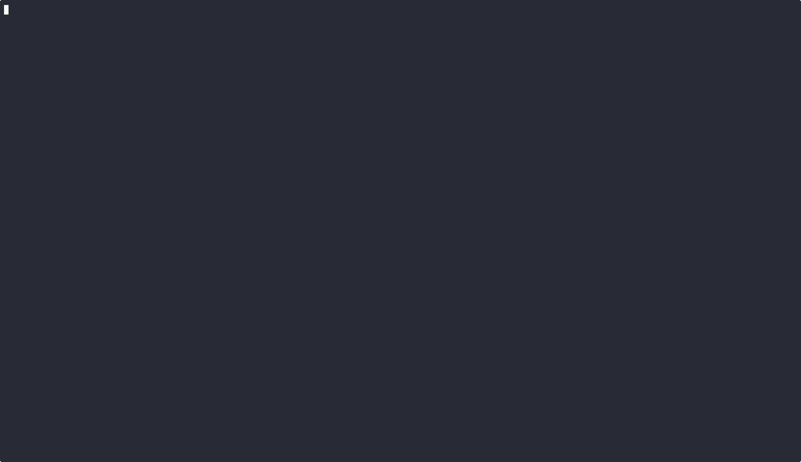

# Reference

## Dashboard Features

- Live table: PID, project, status, context %, cost, $/hr burn rate, elapsed, CPU%, memory, tokens, sparkline
- Parent sessions expand into subagent rows (completed totals + active subagents)
- Detail panel (`Enter`) with full session metadata
- Grouped view (`g`) by project with aggregate stats
- Sort by status, context, cost, burn rate, or elapsed (`s`)
- Live triage filters: status cycle (`f`), focus cycle (`v`), text search (`/`), clear (`z`)
- Conflict detection when 2+ sessions share the same git worktree (`!!`)
- Permission wait time — shows how long sessions have been waiting, longest first

## Status Detection

Multi-signal inference from CPU usage, JSONL events, and timestamps:

| Status | Color | Meaning |
|--------|-------|---------|
| **Needs Input** | Magenta | Waiting for user to approve/confirm a tool use |
| **Processing** | Green | Actively generating or executing tools |
| **Waiting** | Yellow | Done responding, waiting for user's next prompt |
| **Unknown** | Blue | Session is alive, but transcript telemetry is missing or unsupported |
| **Idle** | Gray | No recent activity (>10 min since last message) |
| **Finished** | Red | Process exited |

## Interactive Controls

| Key | Action |
|-----|--------|
| `j`/`k` or `Up`/`Down` | Navigate sessions |
| `Tab` | Switch to session's terminal tab |
| `Enter` | Toggle detail panel |
| `y` | Approve (send Enter to NeedsInput session) |
| `i` | Input mode (type text to session) |
| `d`/`x` | Kill session (double-tap to confirm) |
| `a` | Toggle auto-approve (double-tap to confirm) |
| `n` | Launch wizard for cwd, prompt, and resume |
| `g` | Toggle grouped view by project |
| `s` | Cycle sort column |
| `f` | Cycle status filter |
| `v` | Cycle focus filter (`attention`, budget, context, telemetry, conflicts) |
| `/` | Search project/model/session text |
| `z` | Clear all active filters |
| `c` | Send /compact to session (when idle) |
| `R` | Record session highlight reel (toggle) |
| `b` | Accept brain suggestion for selected session |
| `B` | Reject brain suggestion |
| `K` | Open Skills & Hive mode (see below) |
| `r` | Force refresh |
| `?` | Toggle help overlay |
| `q`/`Esc` | Quit |

### Skills & Hive mode (`K`)

A full-screen mode for discovering Codex skills and managing the local hive. Two tabs, toggle with `Tab`.

{ .terminal-screenshot }


**Skills tab** scans `~/.codex/skills`, `~/.codex/plugins/*/skills`, and `<cwd>/.codex/skills`. A `✓` marks skills already in the local hive store. Hotkeys:

| Key | Action |
|-----|--------|
| `j`/`k` | Navigate the skill list |
| `s` | Share selected skill with the local hive (must be ≤32 KiB) |
| `r` | Re-scan disk |
| `Tab` | Switch to Hive tab |
| `Esc`/`K`/`q` | Return to session table |

**Hive tab** shows your peer identity, listener status, and known peers (read from `~/.codexctl/relay/peers/`). Hotkeys:

| Key | Action |
|-----|--------|
| `h` | Start hive listener (spawns `codexctl relay serve` detached) |
| `i` | Generate invite — relay code, word phrase, and invite link shown inline |
| `J` | Join via a pasted relay code, invite link, or word phrase |
| `r` | Refresh peer list |
| `Tab` | Switch to Skills tab |
| `Esc`/`K`/`q` | Return to session table |

Long-running relay subprocesses run detached so the TUI event loop stays responsive. Requires the `relay` feature to be built in.

## CLI Reference

### Dashboard

| Flag | Description |
|------|-------------|
| (no flags) | Interactive TUI dashboard |
| `-i`, `--interval <ms>` | Refresh interval in milliseconds (default: 2000) |
| `--theme <dark\|light\|none>` | Color theme. Respects `NO_COLOR` env var |
| `--debug` | Show timing metrics in the footer |
| `--demo` | Run with fake sessions for screenshots and demos |

### Output Modes

| Flag | Description |
|------|-------------|
| `-l`, `--list` | Print session table to stdout and exit |
| `--json` | Print JSON array of sessions and exit |
| `-w`, `--watch` | Stream status changes to stdout (no TUI) |
| `--headless` | Run headless with brain, coordination, and context rot prevention active (no TUI). Attach a dashboard with `codexctl` in another terminal |
| `--format <template>` | Custom format for `--watch`. Placeholders: `{pid}`, `{project}`, `{status}`, `{cost}`, `{context}` |
| `--summary` | Show activity summary and exit |
| `--since <duration>` | Time window for `--summary`, `--history`, `--stats` (e.g., "8h", "24h", "7d"). Default: 24h |

### Filtering

| Flag | Description |
|------|-------------|
| `--filter-status <status>` | Filter by status: NeedsInput, Processing, Waiting, Finished, etc. |
| `--focus <filter>` | High-signal subset: `attention`, `over-budget`, `high-context`, `unknown-telemetry`, `conflict` |
| `--search <text>` | Search project/model/session text |

### Session Management

| Flag | Description |
|------|-------------|
| `--new` | Launch a new Codex session |
| `--cwd <path>` | Working directory for the new session (default: `.`) |
| `--prompt <text>` | Prompt to send to the new session |
| `--resume <session-id>` | Resume a previous session by ID |

### Budget & Notifications

| Flag | Description |
|------|-------------|
| `--budget <usd>` | Per-session budget in USD. Alert at 80%, optionally kill at 100% |
| `--kill-on-budget` | Auto-kill sessions that exceed budget (requires `--budget`) |
| `--notify` | Desktop notifications on NeedsInput transitions |
| `--webhook <url>` | Webhook URL to POST JSON on status changes |
| `--webhook-on <statuses>` | Only fire webhook on these transitions (comma-separated, e.g. "NeedsInput,Finished") |

### Brain (Local LLM)

| Flag | Description |
|------|-------------|
| `--brain` | Enable local LLM brain for session advisory |
| `--auto-run` | Auto-execute brain suggestions without confirmation |
| `--url <endpoint>` | LLM endpoint URL (maps to config `[brain] endpoint`) |
| `--brain-model <name>` | Override brain model name (maps to config `[brain] model`) |
| `--brain-eval` | Run brain eval scenarios against the LLM and report results |
| `--brain-prompts` | List brain prompt templates and their source (built-in vs user override) |
| `--brain-stats <metric>` | Brain statistics: `impact`, `learning-curve`, `accuracy`, `baseline`, `false-approve` |
| `--brain-query` | Query brain for a single tool-call decision (JSON output) |
| `--tool <name>` | Tool name for `--brain-query` (e.g., "Bash", "Write") |
| `--tool-input <input>` | Command or file path for `--brain-query` |
| `--project <name>` | Project name for `--brain-query` (default: current directory name) |
| `--mode <on\|off\|auto\|status>` | Set brain gate mode (see Brain Gate Mode below) |
| `--insights [on\|off\|status]` | Show auto-generated insights, or set insights mode. Requires `--brain`. |

### Orchestration

| Flag | Description |
|------|-------------|
| `--decompose <prompt>` | Analyze a prompt and suggest parallel sub-tasks (outputs JSON) |
| `--run <file>` | Run tasks from a JSON file |
| `--parallel` | Run independent tasks in parallel (used with `--run`) |

### Recording

| Flag | Description |
|------|-------------|
| `--record <path>` | Record the TUI as an asciicast v2 file (e.g., `--record demo.cast`) |
| `--duration <secs>` | Auto-quit after N seconds (useful with `--demo --record`) |

Press `R` on any session to record a per-session highlight reel (edits, commands, errors — idle time stripped). In `--demo` mode, a scripted coding session is drip-fed so recording works without live sessions.

### Coordination (--features coord)

Inspect multi-session coordination state. Enabled by default since the supervisor RFC (#342).

| Command | Description |
|---------|-------------|
| `coord events [N] [type]` | Show last N coordination events (default 50), optionally filtered by type |
| `coord leases` | Show active ownership leases |
| `coord blockers` | Show open blockers |
| `coord handoffs` | Show handoffs |
| `coord interrupts` | Show pending interrupts |
| `coord memory` | List recent coordination memory records |
| `coord memory search <q>` | Full-text search coordination memory |
| `coord promote --project <name>` | Promote brain patterns to coordination memory |
| `coord prune [--days N]` | Delete old events, resolved blockers, expired leases (default: 30 days) |

### Supervisor

Durable task lifecycles on top of the bus. See the [README's Supervisor section](../README.md#supervisor) for the design overview and `tasks.toml` shape.

| Command | Description |
|---------|-------------|
| `supervisor run <tasks.toml> [--dry-run]` | Batch-submit one or more tasks from a TOML file (RFC §4 shape) |
| `supervisor submit --name --cwd --prompt [--role ...]` | One-shot inline submission |
| `supervisor status [--state STATE]` | Compact task table; optional state filter (`PENDING` / `RUNNING` / `DONE` / `NEEDS_HUMAN` / …) |
| `supervisor logs <task_id>` | Task detail + full transition log |
| `supervisor cancel <task_id>` | Idempotent move to CANCELLED |
| `supervisor drain` | Set sentinel file at `~/.codexctl/coord/drain`; reconciler stops issuing new assignments |
| `supervisor undrain` | Clear the drain marker |

Coord schema is gated on `PRAGMA user_version`. A binary that meets a newer schema (e.g. after `brew upgrade` without a follow-up `init --upgrade`) refuses to start with the exact remediation in the error.

### Ingest

| Command | Description |
|---------|-------------|
| `ingest --hook <PreToolUse\|PostToolUse\|Stop\|SessionStart\|Notification\|UserPromptSubmit>` | Append the hook's stdin payload to coord `hook_events`. Best-effort by construction — meant to be called from a bash hook with `2>/dev/null \|\| true`. JSONL tail + `ps` stay authoritative; this is a latency optimization for the supervisor's reconciler. |

### Relay (--features relay)

Connect machines, delegate tasks. See the [full relay guide](relay.md).

| Command | Description |
|---------|-------------|
| `relay serve [--port N]` | Start the relay listener for peer connections |
| `relay invite [--qr] [--words]` | Generate invite code, link, and word phrase |
| `relay join <code>` | Connect using any invite format (code, words, or link) |
| `relay discover` | Scan LAN for nearby codexctl instances |
| `relay peers` | List known and connected peers |
| `relay delegate <peer> <prompt>` | Delegate a task to a remote peer |
| `relay identity` | Show this instance's relay identity |

### Hive Mind (--features hive)

Share knowledge, distill learnings. Requires relay for transport.

| Command | Description |
|---------|-------------|
| `hive status` | Knowledge store overview (units, categories, conflicts) |
| `hive knowledge [--from X]` | List knowledge units, filter by peer or scope |
| `hive trust [<peer> [<level>]]` | Show or set peer trust levels |
| `hive export` | Export all knowledge as JSON |
| `hive import <file>` | Import knowledge from JSON file |
| `hive archive [--prune Nd]` | Show cold storage archive stats |
| `hive distill` | Run distillation pipeline (dedup, condense, curriculum) |
| `hive curriculum` | Show distilled curriculum |

### Cleanup

| Flag | Description |
|------|-------------|
| `--clean` | Clean up old session data (JSONL transcripts, session JSON files) |
| `--older-than <duration>` | Only clean sessions older than this (e.g., "7d", "24h") |
| `--finished` | Only clean sessions that have finished |
| `--dry-run` | Show what would be removed without deleting |

### History & Diagnostics

| Flag | Description |
|------|-------------|
| `--autopsy` | Run post-mortem analysis on a completed session transcript |
| `--session <id>` | Session ID or JSONL path for `--autopsy` (defaults to most recent session) |
| `--history` | Show completed session history and exit |
| `--stats` | Show aggregated session statistics and exit |
| `--config` | Show resolved configuration and exit |
| `--config-template` | Print annotated default config template to stdout |
| `--hooks` | List configured event hooks and exit |
| `--doctor` | **Deprecated.** Use `codexctl doctor` instead. Legacy report (terminal compat only) follows after the deprecation note |
| `--log <path>` | Write diagnostic logs to a file |

### Doctor — install + runtime health check

`codexctl doctor` runs eight checks top-down and reports Pass / Advisory / Fail / Skipped with a one-line message and a fix hint for anything broken.

| Check | What it verifies |
|---|---|
| binary on PATH | `which codexctl` matches the running binary |
| Codex hooks | `~/.codex/hooks.json` contains codexctl entries |
| plugin files | `~/.codex/plugins/codexctl/` is populated |
| brain endpoint | `localhost:11434` (ollama) is reachable |
| bus feature | compiled into the binary |
| bus DB | `~/.codexctl/bus/bus.db` opens and is writable |
| session discovery | at least one Codex session detected |
| terminal integration | tab switching / input automation supported |

```bash
codexctl doctor               # human-readable checklist
codexctl doctor --json        # machine-readable for scripting
```

Exit code 0 when every check is Pass / Advisory / Skipped; non-zero on any Fail. Failure messages include the exact command to run (e.g. `codexctl init --plugin-only` when plugin files are missing).

### Setup

Two layers. The **`init` subcommand** is the canonical onboarding wizard (five phases — budget, brain, hooks, bus, skills). The **legacy `--init`/`--uninstall` flags** install/remove only the Codex hook entries and remain supported as the hook-only escape hatch.

#### `codexctl init` — onboarding wizard (preferred)

| Form | Description |
|------|-------------|
| `codexctl init` | Interactive five-phase wizard |
| `codexctl init --non-interactive [--budget N] [--brain-url URL] [--bus-role NAME] [--skip-*]` | Same flow, no prompts. For CI / dotfiles |
| `codexctl init --check` | Drift report — compares the recorded marker against current state, exits non-zero on drift |
| `codexctl init --reset` | Clear the onboarding marker so the next run prompts fresh. Does not touch installed artifacts |
| `codexctl init --remove` | **Soft uninstall.** Strips Codex hooks + clears the marker. Preserves user data (bus DB roles, brain decision logs, hive knowledge, relay identity, config file) |
| `codexctl init --purge [--yes]` | **Hard uninstall.** `--remove` PLUS wipe `~/.codexctl/` (bus DB, brain decisions, hive, relay, coord) and `~/.config/codexctl/config.toml`. Confirms by default; `--yes` skips the prompt. Idempotent |

The wizard records what ran where at `~/.codexctl/onboarding.json` so `--check` can detect drift in later runs.

#### `--init` / `--uninstall` — hook-only (legacy)

| Flag | Description |
|------|-------------|
| `--init` | Wire up Codex hooks in settings and exit |
| `--uninstall` | Remove codexctl hooks from settings and exit |
| `-s`, `--scope <user\|project>` | Configuration scope (default: `user`). Matches Codex's `--scope` convention |

`--init` writes three hooks into Codex's settings:

| Hook | Matcher | Purpose |
|------|---------|---------|
| `PreToolUse` | `Bash` | Lets codexctl observe commands before execution |
| `PostToolUse` | `*` | Notifies codexctl after every tool completion |
| `Stop` | (all) | Notifies codexctl when a session ends |

The hooks call `codexctl --json` on each event. They are safe to run alongside any existing hooks — `--init` merges without overwriting.

`--uninstall` removes only codexctl hook entries, preserving all other hooks. If the file becomes empty after removal, it is deleted.

| Scope | Flag | File | Committed to git? |
|-------|------|------|--------------------|
| `user` (default) | `--init` | `~/.codex/hooks.json` | No (user home) |
| `project` | `--init -s project` | `.codex/hooks.json` | No (gitignored) |

## Cost Tracking

- Per-session USD estimates (Opus, Sonnet, Haiku model pricing)
- Live $/hr burn rate
- Per-session budget alerts at 80%, auto-kill at 100%
- Daily/weekly aggregate cost tracking in title bar
- Unknown models marked as fallback estimates until overridden in config

## Themes

Dark, light, and none (`--theme`). Respects `NO_COLOR` environment variable.

## How It Works

codexctl reads Codex's local data — no API keys, no network access, no modifications to Codex:

- **`~/.codex/sessions/*.json`** — session metadata (PID, session ID, working directory, start time)
- **`~/.codex/projects/{slug}/*.jsonl`** — conversation logs with token usage and events
- **`ps`** — CPU%, memory, TTY for each process
- **`/tmp/codex-{uid}/{slug}/{sessionId}/tasks/`** — subagent task files

Status inference combines multiple signals: `waiting_for_task` events, CPU usage thresholds, `stop_reason` fields, and message recency.

### Brain Query

Query the brain for a single tool-call decision without the TUI. Used by the Codex plugin hook, but also useful for scripting and testing:

```bash
codexctl --brain --brain-query --tool Bash --tool-input "rm -rf /tmp"
codexctl --brain --brain-query --tool Write --tool-input "src/main.rs" --project myapp
```

Output is JSON:

```json
{"action":"deny","reasoning":"Destructive command","confidence":0.95,"source":"brain","below_threshold":false,"threshold":0.6}
```

The decision flow is: deny rules (instant) -> approve rules (instant) -> LLM query -> adaptive threshold check.

If the brain is unreachable, returns `{"action":"abstain","source":"error"}` so callers are never blocked.

### Brain Gate Mode

Control whether the brain hook evaluates tool calls:

```bash
codexctl --mode on                    # Brain evaluates tool calls (default)
codexctl --mode off                   # Disable brain — all calls pass through
codexctl --mode auto                  # Brain auto-approves above threshold
codexctl --mode status                # Show current mode
```

| Mode | Approves safe calls | Denies dangerous calls | Low-confidence calls |
|------|:---:|:---:|:---:|
| `on` | Yes | Yes | Fall through to user |
| `auto` | Yes | Yes | Auto-approve |
| `off` | No | No | Fall through to user |

Mode is stored in `~/.codexctl/brain/gate-mode`. File absent = `on` (default).

## Codex Plugin

codexctl includes a Codex plugin in `codex-plugin/` that integrates the brain directly into sessions.

### Plugin Components

| Component | Type | What it does |
|-----------|------|-------------|
| `brain-gate.sh` | PreToolUse hook | Queries the brain before Bash/Write/Edit/NotebookEdit calls |
| `budget-check.sh` | PreToolUse hook | Denies tool calls when session exceeds budget |
| `/brain` | Command | Toggle brain mode: `/brain on`, `/brain off`, `/brain auto` |
| `/sessions` | Command | Show all active sessions with status, cost, and health |
| `/spend` | Command | Cost breakdown by project and time window |
| `/brain-stats` | Command | Brain learning metrics and accuracy |
| `/auto-insights` | Command | Show or configure auto-generated workflow insights |
| Supervisor | Agent | Proactive session health triage |
| Session Monitoring | Skill | Auto-activated awareness of codexctl capabilities |

### How the brain gate hook works

1. Codex fires a PreToolUse event with the tool name and input
2. The hook checks `~/.codexctl/brain/gate-mode` — if `off`, exits immediately
3. Calls `codexctl --brain --brain-query --tool <name> --tool-input <input>`
4. codexctl checks static deny/approve rules first (instant, no LLM)
5. If no rule matches, queries the local LLM brain
6. Returns `{"decision":"approve"}` or `{"decision":"deny","reason":"..."}` to Codex

In `on` mode, low-confidence brain approvals fall through to normal permission prompts. In `auto` mode, all brain approvals execute.

## Security

codexctl runs entirely locally. It reads Codex's session files from disk and process data from `ps`. It does not:
- Send data to any server (unless you configure webhooks or the brain feature)
- Modify Codex's files or behavior
- Require API keys or authentication
- Run with elevated privileges

Webhook payloads contain session metadata (project name, cost, status). Review your webhook URL and event filters before enabling.

The brain feature sends session context to a **local** LLM endpoint (default `localhost:11434`). No data leaves your machine unless you point `--url` at a remote server.

## Comparison

codexctl was the first tool to combine local LLM supervision with multi-session orchestration for Codex (shipped April 2026).

| Capability | Codex alone | With codexctl |
|-----------|:-:|:-:|
| Local LLM auto-approve/deny | No | Brain with ollama |
| Self-improving insights | No | Friction detection, rule suggestions |
| Session health monitoring | No | 10 checks: cognitive decay, cost spikes, loops, stalls, context, cache, compaction, token efficiency, error acceleration, repetition |
| Orchestrate multi-session workflows | No | Dependency-ordered tasks |
| See status of all sessions at once | No | Live dashboard |
| Track cost per session | Manually | Live $/hr burn rate |
| Enforce spend budgets | No | Auto-kill at limit |
| File conflict detection | No | Auto-detect + brain pre-check + auto-deny |
| Headless daemon mode | No | `--headless` with brain, coordination, and context rot prevention |
| Session autopsy / post-mortem | No | `--autopsy` on completed session transcripts |
| Idle mode / unattended work | No | Run tasks while you sleep |
| Session auto-restart | No | Checkpoint + restart on context saturation |
| Task decomposition | No | Splits prompts into parallel DAGs |
| Auto-rule engine | No | Match by tool/command/project/cost |
| Approve prompts without switching | No | Press `y` |
| Record session highlight reels | No | Press `R` |
| Codex plugin | No | `/brain`, `/sessions`, `/spend`, `/auto-insights` |

| Cross-machine knowledge sharing | No | Peer-to-peer hive mind |
| Remote task delegation | No | Delegate to connected peers |

| Feature | codexctl | Static auto-approve tools | Cloud-based supervisors |
|---------|:---------:|:-------------------------:|:-----------------------:|
| Local LLM brain that learns your preferences | Yes | No | No |
| Cross-session orchestration + context routing | Yes | No | Varies |
| 10-check health monitoring + context rot detection | Yes | No | No |
| File conflict detection across sessions | Yes | No | No |
| Per-tool adaptive confidence thresholds | Yes | No | No |
| Task decomposition into parallel DAGs | Yes | No | No |
| Binary size | ~3.5 MB default / ~6 MB with all features | Varies | N/A |
| Startup time | <50 ms | Varies | N/A |
| Data stays on your machine | 100% | Usually | No |
